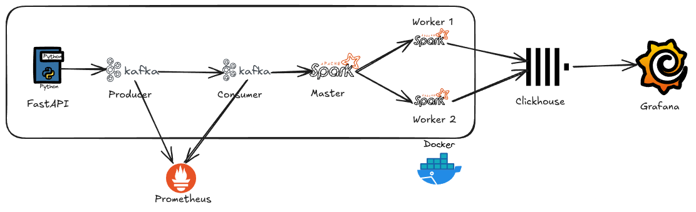
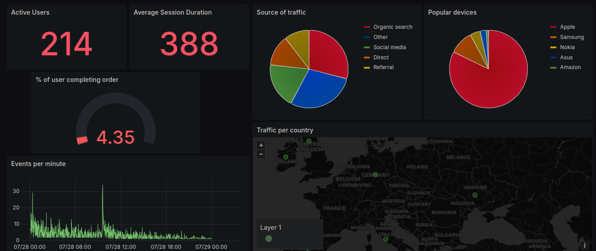

# Clickstream data pipeline
My attempt to make a E<small>T</small>LT pipeline that processes synthetic data and visualizes it in near realtime.

## Features
- Simulate data insertion from multiple users using aiohttp and aiokafka.
- Ingest realtime data into spark streaming
- Monitor Kafak using Prometheus
- Store lightly transformed data in Clickhouse
- Materialized view for simplified aggregation for visualization

## Architecture diagram

<a href="https://iconscout.com/icons/grafana" class="text-underline font-size-sm" target="_blank">Grafana</a> by <a href="https://iconscout.com/contributors/icon-54" class="text-underline font-size-sm">Icon 54</a> on <a href="https://iconscout.com" class="text-underline font-size-sm">IconScout</a>

## How it works
- Python script uses FastAPI to serve data and [FakerClickstream](https://github.com/anuj66283/faker-clickstream).
- Another Python script uses aiohttp to get the data from our API and aiokafka to publish data. We are using aiokafka because it helps to simulate multiple users publish data at once.
- Prometheus is used to monitor Kafka ([Javaagent](https://repo1.maven.org/maven2/io/prometheus/jmx/jmx_prometheus_javaagent/0.6/jmx_prometheus_javaagent-0.6.jar))
- Now the data is ingested by Spark Streaming which again uses Python to perform some light transformations and stores them in Clickhouse.
- In Clickhouse we have some predefined Materialized views which will pre-calculate the values to be visualized. Also TTL is defined to delete data older than 7 days.
- Finally we visualized the data in Grafana.

## How to use
- Rename `env.example` to `.env` and fill the necessary values
- Create required tables and views in Clickhouse
`clickhouse-client --password <password> --multiquery < create_table.sql`
- Now build the image using 
`docker-compose build`
- Run those images using
`docker-compose up`
- To submit the job to spark bash inside spark-master container and execute code below
`spark-submit --master spark://spark-master:7077 --conf spark.streaming.stopGracefullyOnShutdown=true --packages org.apache.spark:spark-sql-kafka-0-10_2.12:3.4.3,com.github.housepower:clickhouse-spark-runtime-3.4_2.12:0.7.1,com.github.housepower:clickhouse-native-jdbc-shaded:2.5.3 jobs/main.py`
- Now the entire pipeline should start working.
- To stop the pipeline
`docker-compose down`

## Dashboard

## Flaws
- Currently I have not used a proper data that look like actual Clickstream data.
- Data is not stored properly (in s3 or other storage medium) and is deleted after 7 days.
- SQL part of this project is not that impressive as all queries are basic group by and aggregation.
- Dashboard doesnot look that good.

## Lastly
- I will be writing a detailed blog about this project where I will share more info and try to fix some of these flaws.